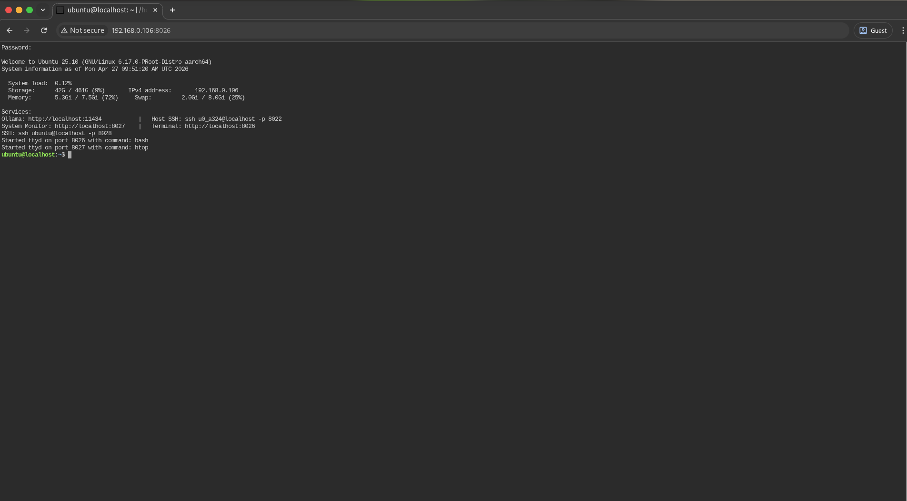
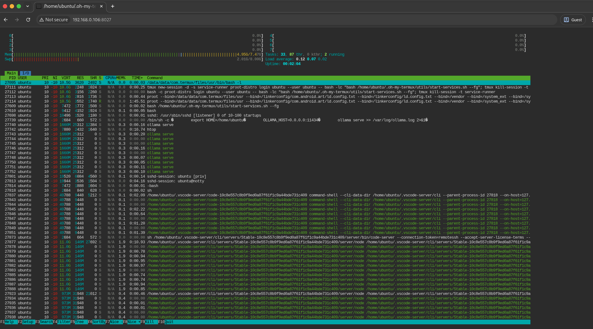

# Claude Code Android

### Full Claude Development Environment on Termux
A complete Claude development environment running on Android via Termux and proot-distro Ubuntu. This project provides a fully automated setup for running Ollama, Claude CLI, web terminal access, and SSH — all from your Android device.

> **Tested on:** Termux `v0.119.0-beta` (version code `1022`)

---

## Architecture Overview

The system is split into two layers:

| Layer | Environment | Role |
|-------|-------------|------|
| **Host** | Termux (Android) | Entry point, proot-distro management, host SSH (`sshd`) |
| **Guest** | Ubuntu via proot-distro | Development environment: Ollama, Claude CLI, web terminal, guest SSH |

### Auto-Start Flow
1. Termux boots and starts `sshd` (port `8022`)
2. A tmux session `service-runner` is created automatically
3. The supervisor enters Ubuntu and ensures SSH (port `8028`) and Ollama are running
4. On every Ubuntu login, `.extra_bashrc` starts `ttyd` (web terminal on `8026`) and `htop` (system monitor on `8027`)

---

## Screenshots

### Web Terminal (ttyd)



Access your terminal from any browser at `http://<your-phone-ip>:8026`

### System Monitor (htop via ttyd)



Monitor system resources in real time at `http://<your-phone-ip>:8027`

---

## Quick Start

### 1. Install Termux

Download and install Termux `v0.119.0-beta` (version code `1022`) from [GitHub Releases](https://github.com/termux/termux-app/releases) or [F-Droid](https://f-droid.org/packages/com.termux/).

> Do not use the Play Store version — it is outdated and unsupported.

### 2. Run the Setup

Open Termux and execute:

```bash
curl -fsSL https://raw.githubusercontent.com/0xAungkon/Full-Claude-Environment-Termux/main/setup-termux.sh | bash
```

Or clone and run manually:

```bash
pkg update && pkg install git -y
git clone https://github.com/0xAungkon/Full-Claude-Environment-Termux.git
cd Full-Claude-Environment-Termux
bash setup-termux.sh
```

The script will:
- Update Termux and install `proot-distro`, `tmux`, `openssh`, `curl`
- Install Ubuntu via `proot-distro`
- Create the `ubuntu` user with passwordless sudo
- Clone this repo into `/home/ubuntu/.oh-my-termux`
- Install Ollama, `uv`, `claude` CLI, `ttyd`, `gh`, and other tools
- Configure SSH on port `8028`
- Set up auto-start services

### 3. Log in to Ubuntu

```bash
ubuntu
```

Or from Termux:

```bash
proot-distro login ubuntu --user ubuntu
```

---

## Port Map

| Port | Service | Description |
|------|---------|-------------|
| `11434` | Ollama API | LLM inference endpoint (`OLLAMA_HOST=0.0.0.0:11434`) |
| `8026` | Web Terminal | `ttyd` running `bash` (password protected) |
| `8027` | System Monitor | `ttyd` running `htop` (password protected) |
| `8028` | Guest SSH | Ubuntu SSH daemon |
| `8022` | Host SSH | Termux SSH daemon |

---

## Service Management

### Supervisor (SSH + Ollama)

The supervisor runs inside a tmux session named `service-runner`. It polls every 60 seconds and restarts services if they go down.

**Start in foreground (for debugging):**
```bash
bash /home/ubuntu/.oh-my-termux/utils/start-services.sh --fg
```

**Start once (exit after one check):**
```bash
bash /home/ubuntu/.oh-my-termux/utils/start-services.sh
```

**Alias (defined in `.extra_bashrc`):**
```bash
tss
```

### Ollama

The Ollama daemon is managed by an LSB-style init script at `/home/ubuntu/.oh-my-termux/services/ollama`.

```bash
sudo /home/ubuntu/.oh-my-termux/services/ollama start
sudo /home/ubuntu/.oh-my-termux/services/ollama stop
sudo /home/ubuntu/.oh-my-termux/services/ollama restart
sudo /home/ubuntu/.oh-my-termux/services/ollama status
```

**Verify Ollama is serving:**
```bash
curl http://localhost:11434/api/tags
```

### SSH

```bash
sudo service ssh status
sudo service ssh restart
```

**Connect from another device:**
```bash
ssh ubuntu@<phone-ip> -p 8028
```

### Web Terminal (ttyd)

`ttyd` instances are auto-started on every Ubuntu login via `.extra_bashrc`. They are password-protected via `utils/ttyd-auth.sh`.

**Manual start:**
```bash
# Web terminal on port 8026
ttyd

# System monitor on port 8027
htop
```

These are aliases defined in `.extra_bashrc` that call the `start_ttyd` function.

---

## Environment Variables

The following variables are exported on every Ubuntu login via `.extra_bashrc`:

| Variable | Value | Purpose |
|----------|-------|---------|
| `OLLAMA_HOST` | `0.0.0.0:11434` | Bind Ollama to all interfaces |
| `ANTHROPIC_BASE_URL` | `http://localhost:11434` | Point Claude tools at local Ollama |
| `ANTHROPIC_AUTH_TOKEN` | `ollama` | Dummy token for local Ollama |
| `ANTHROPIC_DEFAULT_SONNET_MODEL` | `kimi-k2.6:cloud` | Default Sonnet model alias |
| `ANTHROPIC_DEFAULT_HAIKU_MODEL` | `minimax-m2.7:cloud` | Default Haiku model alias |
| `ANTHROPIC_DEFAULT_OPUS_MODEL` | `kimi-k2.5:cloud` | Default Opus model alias |
| `XDG_CONFIG_HOME` | `$HOME/.config` | XDG base directory |
| `XDG_CACHE_HOME` | `$HOME/.cache` | XDG base directory |
| `XDG_DATA_HOME` | `$HOME/.local/share` | XDG base directory |

---

## Key Files

| File | Purpose |
|------|---------|
| `setup-termux.sh` | One-time setup script run from Termux |
| `utils/setup-instance.sh` | Guest bootstrap: apt installs, uv/ollama/claude installers, SSH config, wires `.extra_bashrc` |
| `.extra_bashrc` | Guest environment: Ollama/Claude API vars, `start_ttyd` function, aliases, auto-starts ttyd/htop |
| `utils/start-services.sh` | Service supervisor loop (SSH + Ollama) |
| `services/ollama` | Init.d script for Ollama daemon |
| `utils/ttyd-auth.sh` | ttyd password credential checker |
| `utils/system-info.sh` | Welcome banner printed on guest login |

---

## Common Commands

### Re-run guest setup (after modifying `setup-instance.sh`)

```bash
proot-distro login ubuntu --user ubuntu -- bash -lc "bash /home/ubuntu/.oh-my-termux/utils/setup-instance.sh"
```

### Attach to the supervisor tmux session from Termux

```bash
tmux attach -t service-runner
```

### Check system info (welcome banner)

```bash
bash /home/ubuntu/.oh-my-termux/utils/system-info.sh
```

### Pull an Ollama model

```bash
ollama pull llama3
```

### Run Claude CLI

```bash
claude
```

---

## URLs and Endpoints

| Endpoint | URL | Notes |
|----------|-----|-------|
| Ollama API | `http://localhost:11434` | OpenAI-compatible local LLM API |
| Ollama Tags | `http://localhost:11434/api/tags` | List installed models |
| Web Terminal | `http://localhost:8026` | Browser-based terminal (password required) |
| System Monitor | `http://localhost:8027` | Browser-based htop (password required) |

Replace `localhost` with your Android device's IP address to access from other devices on the same network.

---

## Troubleshooting

### Services not starting
Check the supervisor tmux session:
```bash
tmux attach -t service-runner
```

### Ollama not responding
Restart Ollama manually:
```bash
sudo /home/ubuntu/.oh-my-termux/services/ollama restart
```

### SSH connection refused
Ensure the guest SSH service is running:
```bash
sudo service ssh status
sudo service ssh restart
```

### ttyd ports already in use
Kill existing ttyd processes:
```bash
pkill -f ttyd
```
Then log out and back in to Ubuntu.

---

## Credits

Developed by [0xAungkon](https://github.com/0xAungkon)  
Version 1.0.8
